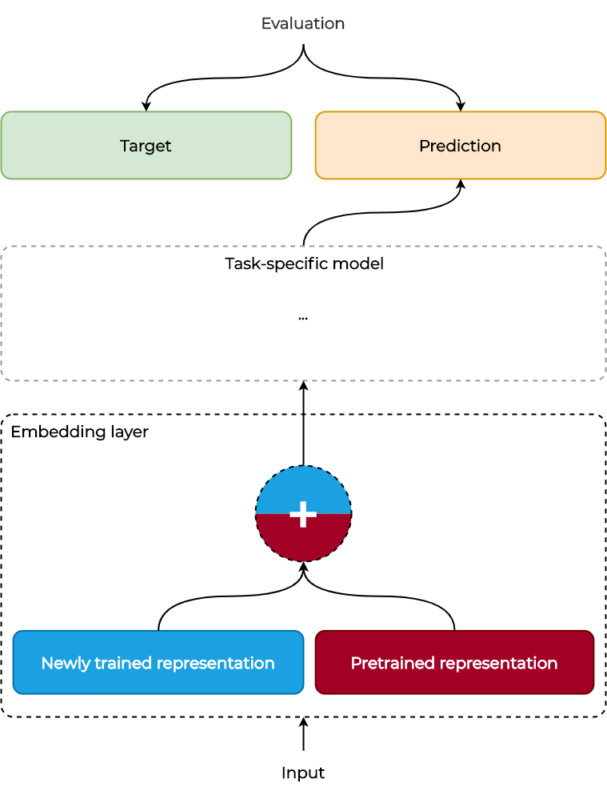

# Improving historical language modelling using Transfer Learning

[](https://doi.org/10.5281/zenodo.4033104)
[](https://www.python.org/) 
[](https://pytorch.org/docs/1.3.1/) 
[](LICENSE)

## Abstract

_Transfer learning has recently delivered substantial gains across a wide variety of tasks. In Natural Language Processing, mainly in the form of pre-trained language models, it was proven beneficial as well, helping the community push forward many low-resource languages and domains. Thus, naturally, scholars and practitioners working with OCR'd historical corpora are increasingly exploring the use of pre-trained language models. Nevertheless, the specific challenges posed by documents from the past, including OCR quality and language change, call for a critical assessment over the use of pre-trained language models in this setting._

_We find that pre-trained language models help with NER but not with post-OCR correction. Furthermore, we show that this improvement is not coming from the increase of the network size but precisely from the transferred knowledge. We further show how multi-task learning can speed up historical training while achieving similar results for NER. In all challenges, we investigate the importance of data quality and size, with them emerging as one of the fragments currently hindering progress in the historical domain the most. Moreover, for LSC we see that due to the lack of standardised evaluation criteria and introduced bias during annotation, important encoded knowledge can be left out. Finally, we share with community our implemented modular setup which can be used to further assess and conclude the current state of transfer learning applicability over ancient documents._

_As a conclusion, we emphasise that pre-trained language models should be used critically when working with OCR'd historical corpora._

## Description

This is a repository presenting a highly modular architecture that we use for evaluating Transfer Learning applicability over historical texts. Due to the nature of it, we design our system so that implementation of additional modules is eased and encouraged. The generic module can be seen below. Additional architectures and figures of task-specific models can be seen in the respective documentation for each task

<p align="center">
    
</p>

## Publications

The code was used in the following papers and documents.

- **Improving historical language modelling using Transfer Learning** - My MSc Thesis, University of Amsterdam, 2020 (link: [here](https://scripties.uba.uva.nl/search?id=717875))
- **Transfer learning for historical corpora: An assessment on post-OCR correction and named entity recognition** - Online workshop on Computational Humanities Research, 2020 (link: TBD)
- **Transfer Learning for Named Entity Recognition in Historical Corpora** - CLEF-HIPE-2020 (link: TBD)

## Requirements

See [`environment.yml`](environment.yml) for a full list of modules and libraries that were used during development, as well as a way to restore this environment using Conda.

## Usage

Currently, there are three different challenges that are implemented. Depending on which is of interest, different configuration set of arguments can be used. 

- The main file would always be `run.py`
- You must always supply at least `challenge` and `configuration` as arguments. Based on these, a different set of arguments is then loaded and there might be additional required arguments. Full list of currently available, working and implemented challenges and configurations follows.

| Challenge  | Configuration | Link to arguments |
| ---------- | ------------- | ----------------- |
| `post-ocr-correction` | `char-to-char-encoder-decoder` | [link](docs/arguments/postocr_arguments_service.md) |
| `named-entity-recognition` | `bi-lstm-crf` | [link](docs/arguments/ner_arguments_service.md) |
| `semantic-change` | `kbert` | N/A |
| `semantic-change` | `cbow` | [link](docs/arguments/semantic_arguments_service.md) |

In addition to challenge-specific arguments, there are number of arguments which are available always. Full description of those can be seen [here](docs/arguments/base_arguments.md)

Finally, this codebase follows the dependency injection pattern. Dependencies are "injected" in [ioc_container.py](dependency_injection/ioc_container.py) which then can be used by passing them as arguments to the constructor of each service or object. This pattern allows for the separation of the services and different challenges and configurations, as well as for a future implementation of automatic testing.

Example run command:
> python run.py --challenge xxx --configuration yyy --device cuda [... _challenge-specific arguments_ ...]

## Contribution

We encourage the implementation of additional modules and welcome contributions to this repository. In order to accept such, the following must be available in every submitted pull request:

- New challenge and/or configuration added to the respective enumerations ([challenge.py](enums/challenge.py) and [configuration.py](enums/configuration.py)). These must then be linked in the dependency initialization process, similar as with previous implementations.
- Implementation of the new model (`/models/{configuration}/`), loss function (`/losses/`) and optimizer (`/optimizers/`) must be done. These all need to inherit the respective base objects. Some of these can be skipped if the new implementation is re-using existing ones. However, these must still be linked during the dependency initialization to the new challenge and/or configuration.
- Arguments service implementation (optional, only if new arguments are introduced). This must be located in `/services/arguments/` and must be linked in the dependency initialization process.
- Implementation of the corresponding dataset (`/datasets/`) and linking it to the specific challenge/configuration in [dataset_service.py](services/dataset_service.py)
- Evaluation service must be implemented in `/services/evaluation/`, inheriting from `base_evaluation_service.py` and linked in the dependency initialization.
- If needed, a process service can be implemented in `/services/process/`. This must then be attached in the dependency initialization to the corresponding challenge/configuration.
- If needed, a tokenize service can be implemented in `/services/tokenize/`. This must then be attached again in the dependency initialization to the corresponding challenge/configuration.
- Additional services can be implemented if needed, but will only be accepted if they are fully generic and not specific for a certain challenge or configuration. Exception are download services (`/services/download/`) which can be specific to a certain dataset.

Should you notice any errors or have any suggestions on how this repository can be improved, you are welcome to submit a pull request.

## Citing

Please use the following format when citing this repository
```
@inproceedings{Todorov_Colavizza_2020,
    author =    {Todorov, Konstantin and Colavizza, Giovanni},
    title =     {Transfer learning for historical corpora: An assessment on post-OCR correction and named entity recognition},
    year =      {2020},
    month =     {Nov},
    booktitle = {CHR 2020: Workshop on Computational Humanities Research}
}
```