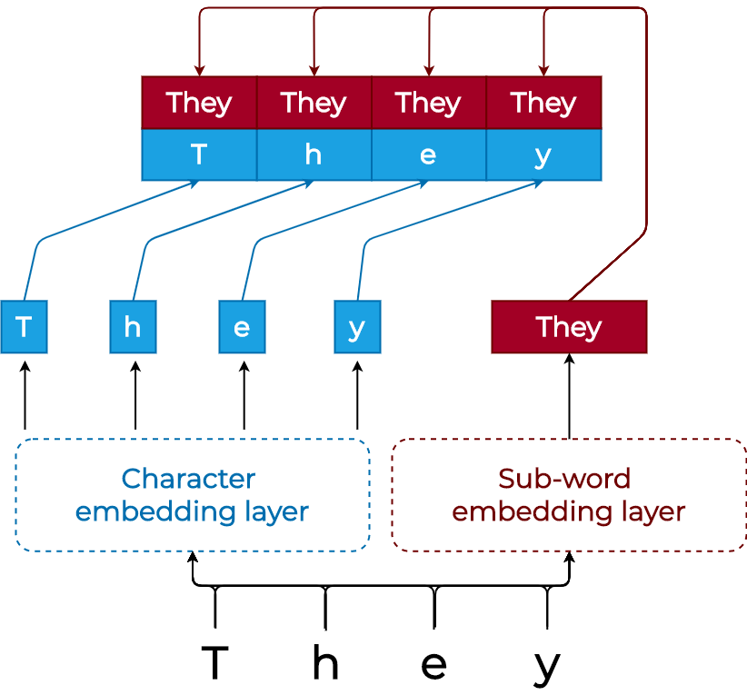

[< go back to main page](../../README.md)

# Post-OCR correction arguments

## Description

This page describes the arguments used in the `post-ocr-correction` challenge and `char-to-char-encoder-decoder` configuration. These derive from the [PostOCRArgumentsService](../../services/arguments/postocr_arguments_service.py).

## Model

We combine the embedding layer with an encoder-decoder architecture with attention (similar to [this one](https://arxiv.org/abs/1409.0473)). Thus we consider the raw OCR version of a text and ground truth as two distinct languages. We then train the model to translate from the first to the latter. Our architecture works at a character level and thus also concatenates pre-trained sub-word information to every character. This is visible in the first figure below. The second figure shows an example pass through the decoder.

<table>
    <tr>
        <td style='border-right: 1px solid black;'>
            </td>
        <td style='border-left: 1px solid black;'>
            </td>
    </tr>
</table>

## Arguments

| Argument     | Type          | Default value  | Description |
| ------------- | ------------- | -------------- |-------------|
| `encoder-embedding-size` | `int` | 128 | The size used for generating embeddings in the encoder |
| `decoder-embedding-size` | `int` | 16 | The size used for generating embeddings in the decoder |
| `share-embedding-layer` | `bool` | False | If set to true, the embedding layer of the encoder and decoder will be shared |
| `hidden-dimension` | `int` | 256 | The dimension size used for hidden layers |
| `dropout` | `float` | 0.0 | Dropout probability |
| `number-of-layers` | `int` | 1 | Number of layers used for RNN or Transformer models |
| `bidirectional` | `bool` | False | Whether the RNN used will be bidirectional |
| `use-beam-search` | `bool` | False | If set to true, beam search will be used for decoding instead of greedy decoding |
| `beam-width` | `int` | 3 | Width of the beam when using beam search. Defaults to 3 |


## Usage

Example of usage cases for the Post-OCR correction challenge

### Training

```bash
python run.py --challenge post-ocr-correction --configuration char-to-char-encoder-decoder --device cuda --eval-freq 50 --seed 13 --learning-rate 1e-3 --metric-types levenshtein-distance jaccard-similarity --language english --checkpoint-name english-post-ocr --batch-size 4 --pretrained-weights bert-base-cased --pretrained-model-size 768 --pretrained-max-length 512 --include-fasttext-model --fasttext-model en-ft.bin --fasttext-model-size 300 --learn-new-embeddings --share-embedding-layer --hidden-dimension 512 --encoder-embedding-size 64 --decoder-embedding-size 64 --dropout 0.5 --number-of-layers 2 --bidirectional --patience 10000
```

### Evaluation

```bash
python run.py --challenge post-ocr-correction --configuration char-to-char-encoder-decoder --device cuda --seed 13 --language english --batch-size 32 --checkpoint-name english-post-ocr --evaluate --evaluation-type jaccard-similarity levenshtein-edit-distance-improvement --pretrained-weights bert-base-cased --include-pretrained-model --fine-tune-pretrained --fine-tune-learning-rate 1e-4 --pretrained-model-size 768 --pretrained-max-length 512 --include-fasttext-model --fasttext-model en-ft.bin --fasttext-model-size 300 --learn-new-embeddings --share-embedding-layer --hidden-dimension 512 --encoder-embedding-size 64 --decoder-embedding-size 64 --dropout 0.5 --number-of-layers 2 --bidirectional
```

## Data

The data which is provided by the organizers of the ICDAR 2019 challenge includes noisy OCR of printed texts from different sources and ten languages. We focus on English, German and French. We additionally make use of the full French and English data from the ICDAR 2017 challenge. Finally we use Overproof data in English ([link to website](https://overproof.projectcomputing.com/)) to further increase our dataset size.

## Results

Our results, ordered by the inclusion of the different embedding modules, are displayed below.

### French

<table>
    <tr>
        <th rowspan="2">Configuration</th>
        <th colspan="2">Levenshtein distance</th>
        <th colspan="2">Normalized Jaccard similarity</th>
    </tr>
    <tr>
        <th>Average</th>
        <th>% improvement</th>
        <th>Average</th>
        <th>% improvement</th>
    </tr>
    <tr>
        <td>No correction</td>
        <td>3.568</td>
        <td>-</td>
        <td>0.926</td>
        <td>-</td>
    </tr>
    <tr>
        <td>Base</td>
        <td><b>3.369</b></td>
        <td><b>5.579</b></td>
        <td>0.93</td>
        <td>0.824</td>
    </tr>
    <tr>
        <td>Base + FT</td>
        <td>3.442</td>
        <td>3.522</td>
        <td>0.93</td>
        <td>0.855</td>
    </tr>
    <tr>
        <td>Base + BERT</td>
        <td>3.393</td>
        <td>4.896</td>
        <td>0.93</td>
        <td>0.881</td>
    </tr>
    <tr>
        <td>Base + FT + BERT</td>
        <td><i>3.389</i></td>
        <td><i>5.020</i></td>
        <td>0.934</td>
        <td>0.850</td>
    </tr>
    <tr>
        <td colspan="5">+ Fine-tuning (unfreezing, from start) BERT</td>
    </tr>
    <tr>
        <td>Base + BERT</td>
        <td>3.441</td>
        <td>3.565</td>
        <td>0.930</td>
        <td>0.722</td>
    </tr>
    <tr>
        <td>Base + FT + BERT</td>
        <td>3.397</td>
        <td>4.784</td>
        <td><b>0.936</b></td>
        <td><b>1.008</b></td>
    </tr>
    <tr>
        <td colspan="5">
            + Fine-tuning (unfreezing, after initial convergence) BERT</td>
    </tr>
    <tr>
        <td>Base + BERT</td>
        <td>3.401</td>
        <td>4.668</td>
        <td><i>0.935</i></td>
        <td><i>0.923</i></td>
    </tr>
    <tr>
        <td>Base + FT + BERT</td>
        <td>3.448</td>
        <td>3.347</td>
        <td><i>0.935</i></td>
        <td>0.900</td>
    </tr>
</table>

<br/>
<br/>

### German

<table>
    <tr>
        <th rowspan="2">Configuration</th>
        <th colspan="2">Levenshtein distance</th>
        <th colspan="2">Normalized Jaccard similarity</th>
    </tr>
    <tr>
        <th>Average</th>
        <th>% improvement</th>
        <th>Average</th>
        <th>% improvement</th>
    </tr>
    <tr>
        <td>No correction</td>
        <td>12.008</td>
        <td>-</td>
        <td>0.656</td>
        <td>-</td>
    </tr>
    <tr>
        <td>Base</td>
        <td><i>4.302</i></td>
        <td><i>64.172</i></td>
        <td><b>0.900</b></td>
        <td><i>37.290</i></td>
    </tr>
    <tr>
        <td>Base + FT</td>
        <td>4.439</td>
        <td>63.034</td>
        <td>0.896</td>
        <td>36.584</td>
    </tr>
    <tr>
        <td>Base + BERT</td>
        <td>4.464</td>
        <td>62.827</td>
        <td>0.896</td>
        <td>36.630</td>
    </tr>
    <tr>
        <td>Base + FT + BERT</td>
        <td>5.393</td>
        <td>55.088</td>
        <td>0.872</td>
        <td>32.938</td>
    </tr>
    <tr>
        <td colspan="5">+ Fine-tuning (unfreezing, from start) BERT</td>
    </tr>
    <tr>
        <td>Base + BERT</td>
        <td><b>4.283</b></td>
        <td><b>64.334</b></td>
        <td><b>0.900</b></td>
        <td><b>37.324</b></td>
    </tr>
    <tr>
        <td>Base + FT + BERT</td>
        <td>4.340</td>
        <td>63.863</td>
        <td>0.899</td>
        <td>37.131</td>
    </tr>
    <tr>
        <td colspan="5">+ Fine-tuning (unfreezing, after initial convergence) BERT}</td>
    </tr>
    <tr>
        <td>Base + BERT</td>
        <td>4.344</td>
        <td>63.828</td>
        <td>0.898</td>
        <td>37.039</td>
    </tr>
    <tr>
        <td>Base + FT + BERT</td>
        <td>4.411</td>
        <td>63.271</td>
        <td>0.898</td>
        <td>36.908</td>
    </tr>
</table>

<br/>
<br/>

### English

<table>
    <tr>
        <th rowspan="2">Configuration</th>
        <th colspan="2">Levenshtein distance</th>
        <th colspan="2">Normalized Jaccard similarity</th>
    </tr>
    <tr>
        <th>Average</th>
        <th>% improvement</th>
        <th>Average</th>
        <th>% improvement</th>
    </tr>
    <tr>
        <td>No correction</td>
        <td><b>9.397</b></td>
        <td>-</td>
        <td>0.825</td>
        <td>-</td>
    </tr>
    <tr>
        <td>Base</td>
        <td>9.955</td>
        <td>-5.944</td>
        <td>0.822</td>
        <td>-0.310</td>
    </tr>
    <tr>
        <td>Base + FT</td>
        <td>9.864</td>
        <td>-4.971</td>
        <td>0.825</td>
        <td>-0.005</td>
    </tr>
    <tr>
        <td>Base + BERT</td>
        <td>10.228</td>
        <td>-8.840</td>
        <td>0.822</td>
        <td>-0.364</td>
    </tr>
    <tr>
        <td>Base + FT + BERT</td>
        <td>9.992</td>
        <td>-6.338</td>
        <td>0.825</td>
        <td>-0.006</td>
    </tr>
    <tr>
        <td colspan="5">+ Fine-tuning (unfreezing, from start) BERT</td>
    </tr>
    <tr>
        <td>Base + BERT</td>
        <td>9.835</td>
        <td>-4.665</td>
        <td>0.825</td>
        <td>0.062</td>
    </tr>
    <tr>
        <td>Base + FT + BERT</td>
        <td>9.787</td>
        <td><i>-4.151</i></td>
        <td>0.825</td>
        <td>0.078</td>
    </tr>
    <tr>
        <td colspan="5">+ Fine-tuning (unfreezing, after initial convergence) BERT</td>
    </tr>
    <tr>
        <td>Base + BERT</td>
        <td><i>9.724</i></td>
        <td><b>-3.483</b></td>
        <td><b>0.829</b></td>
        <td><b>0.510</b></td>
    </tr>
    <tr>
        <td>Base + FT + BERT</td>
        <td>9.927</td>
        <td>-5.639</td>
        <td><i>0.826</i></td>
        <td><i>0.108</i></td>
    </tr>
</table>

<br/>
<br/>

### Dutch

<table>
    <tr>
        <th rowspan="2">Configuration</th>
        <th colspan="2">Levenshtein distance</th>
        <th colspan="2">Normalized Jaccard similarity</th>
    </tr>
    <tr>
        <th>Average</th>
        <th>% improvement</th>
        <th>Average</th>
        <th>% improvement</th>
    </tr>
    <tr>
        <td>No correction</td>
        <td>12.984</td>
        <td>-</td>
        <td>0.726</td>
        <td>-</td>
    </tr>
    <tr>
        <td>Base</td>
        <td>11.011</td>
        <td>15.195</td>
        <td><b>0.801</b></td>
        <td><b>10.394</b></td>
    </tr>
    <tr>
        <td>Base + BERT</td>
        <td>11.055</td>
        <td>14.862</td>
        <td>0.798</td>
        <td>9.977</td>
    </tr>
    <tr>
        <td colspan="5">+ Fine-tuning (unfreezing, from start) BERT</td>
    </tr>
    <tr>
        <td>Base + BERT</td>
        <td><i>10.877</i></td>
        <td><i>16.229</i></td>
        <td><b>0.801</b></td>
        <td><b>10.394</b></td>
    </tr>
    <tr>
        <td colspan="5">+ Fine-tuning (unfreezing, after initial convergence) BERT</td>
    </tr>
    <tr>
        <td>Base + BERT</td>
        <td><b>10.785</b></td>
        <td><b>16.938</b></td>
        <td><i>0.799</i></td>
        <td><i>10.123</i></td>
    </tr>
</table>