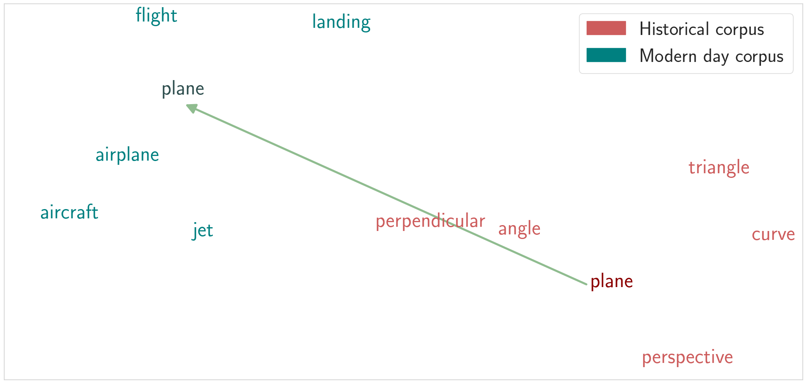
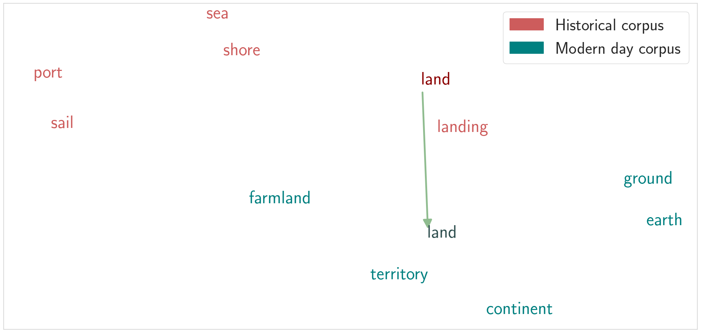

[< go back to main page](../../README.md)

# Semantic change arguments

## Description

This page describes the arguments used in the `semantic-change` challenge and `kbert` or `cbow` configuration. These derive from the [SemanticArgumentsService](../../services/arguments/semantic_arguments_service.py).

## Model

We simply fine-tune BERT and a simple CBOW model. These two are selected using the `configuration` argument.

## Arguments

| Argument     | Type          | Default value  | Description |
| ------------- | ------------- | -------------- |-------------|
| `word-distance-threshold` | `float` | None | The threshold which will be used to compare against word distance for the SemEval challenge
| `corpus` | `int` | None | The corpus to be used
| `plot-distances` | `bool` | False | Plot distances of target words for the different time periods
| `word-distance-threshold-calculation` | [`ThresholdCalculation`](../../enums/threshold_calculation.py) | Mean | Calculation of the threshold in case a constant value is not given
| `word-embeddings-size` | `int` | 128 | The size for the word embeddings layer
| `rnn-hidden-size` | `int` | 64 | The size for the word embeddings layer


## Usage

Example of usage cases for the Semantic Change challenge

### Training

```bash
python run.py --challenge semantic-change --configuration cbow --device cuda --eval-freq 100 --seed 13 --learning-rate 1e-5 --language english --corpus 1 --checkpoint-name local-1 --batch-size 128 --skip-validation
```

### Evaluation

```bash
python run.py --challenge semantic-change --configuration cbow --device cuda --seed 13 --corpus 1 --language english --batch-size 1 --joint-model --evaluate --evaluation-type cosine-distance euclidean-distance --word-distance-threshold-calculation median
```

## Results

We showcase below two of the target words in the challenge and the lexical semantic change that BERT captures for the two time periods. For each time period, the neighbourhood (five closest words) for the target word is shown.

<table>
    <tr>
        <td style='border-right: 1px solid black;'>
            
        </td>
        <td style='border-left: 1px solid black;'>
            
        </td>
    </tr>
</table>

## Data

Data consists of four languages (English, German, Latin and Swedish) and documents from two time periods for each language.